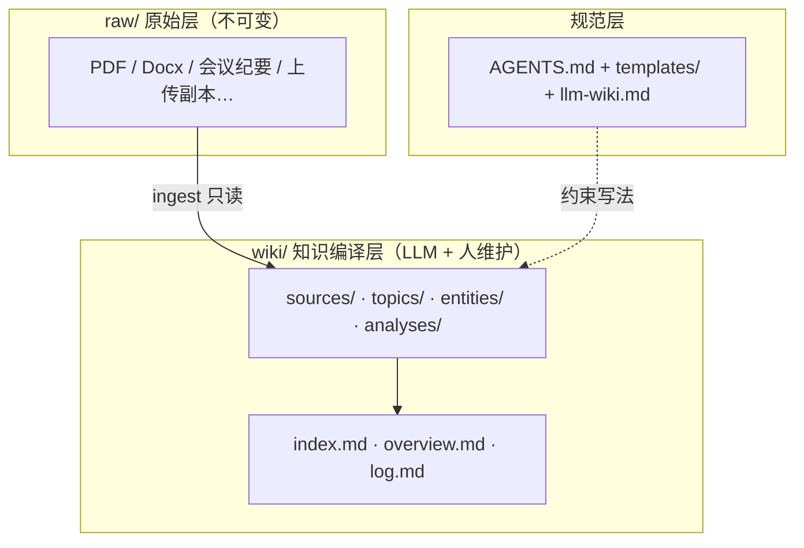

# Wiki 资源（`backend/resources`）详细说明与分析

> **文档目的**：说明 `base_Platform` 当前 Wiki 模板「是什么、从哪来、里面有什么、平台已做什么、尚未做什么」，便于产品、后端与 Agent 协作时对齐预期。  
> **相关路径**：`backend/resources/wiki_template/` · 运行时 `workspace/projects/{project_slug}/` · 设计文档 `docs/WIKI_WORKSPACE_TEMPLATE.md`

---

## 目录

1. [定位与来源](#1-定位与来源)
2. [资源目录结构](#2-资源目录结构)
3. [方法论：三层架构与三种工作流](#3-方法论三层架构与三种工作流)
4. [模板内各文件职责](#4-模板内各文件职责)
5. [页面类型与 frontmatter 约定](#5-页面类型与-frontmatter-约定)
6. [模板中的「示例内容」说明](#6-模板中的示例内容说明)
7. [平台已实现的工程能力](#7-平台已实现的工程能力)
8. [与 GraphRAG / 分析任务的关系](#8-与-graphrag--分析任务的关系)
9. [数据库 `wiki_pages` 与文件系统分工](#9-数据库-wiki_pages-与文件系统分工)
10. [运行时实例：PCG 项目](#10-运行时实例pcg-项目)
11. [尚未实现 / 待接能力](#11-尚未实现--待接能力)
12. [运维与升级策略](#12-运维与升级策略)

---

## 1. 定位与来源

### 1.1 这是什么

`backend/resources/wiki_template/base_wiki/` 是一套 **中文优先的 LLM Wiki 脚手架**（只读「金样」），用于：

- 给每个业务项目（如 PCG）在磁盘上生成**统一目录结构**；
- 约束 Agent / 人工维护知识时的**写作规范**（`AGENTS.md` + `templates/`）；
- 与 MinIO 上的**原始上传文件**、GraphRAG 的 **parquet/LanceDB** 产物分工：Wiki 面向**人类可读、可交叉引用的 Markdown**，不是模型中间文件仓库。

### 1.2 思想来源

| 来源 | 说明 |
|------|------|
| [karpathy/llm-wiki.md](https://gist.github.com/karpathy/442a6bf555914893e9891c11519de94f) | 英文「想法文件」：持久化 Wiki、增量编译知识，而非每次查询重扫 raw |
| 仓库内 `base_wiki/llm-wiki.md` | 上述思想的中文仓库内副本（英文正文） |
| `Chinese-LLM-Wiki-main`（脱敏版） | 已沉淀为 `ltt/Chinese-LLM-Wiki-extracted/.../LLM-WIKI-TOOLS.md` 的活动流说明；**平台模板取其目录结构与 AGENTS 规则，不依赖外部路径** |

### 1.3 与「普通 RAG」的差异

| 对比项 | 典型 RAG | 本 Wiki 模式 |
|--------|----------|--------------|
| 知识形态 | 切块 + 向量，查询时临时拼上下文 | **预编译**为来源页 / 主题页 / 实体页 / 分析页 |
| 跨文档综合 | 每次重新检索拼接 | 已在 `wiki/topics`、`wiki/overview` 中沉淀 |
| 矛盾与修订 | 难追踪 | `wiki/log.md` + lint 流程显式记录 |
| raw 原件 | 常被覆盖或混入摘要 | **`raw/` 不可变**，摘要只在 `wiki/` |

---

## 2. 资源目录结构

### 2.1 仓库内（只读模板）

```text
backend/resources/
├── WIKI_RESOURCES_ANALYSIS_ZH.md    # 本文档
└── wiki_template/
    ├── README.md                     # 指向 base_wiki 与 docs/WIKI_WORKSPACE_TEMPLATE.md
    └── base_wiki/                    # copytree 源（11 个可见文件 + 占位目录）
        ├── README.md                 # 中文使用说明（原则、目录、工作流）
        ├── AGENTS.md                 # LLM 维护者行为规范（强制规则）
        ├── llm-wiki.md               # 方法论（英文 idea file）
        ├── raw/
        │   └── .gitkeep              # 占位；真实原件不进 Git
        ├── templates/                # 5 类页面模板
        │   ├── source-page.md
        │   ├── topic-page.md
        │   ├── entity-page.md
        │   ├── analysis-page.md
        │   └── lint-report.md
        └── wiki/
            ├── index.md              # 中文总目录（含示例条目）
            ├── overview.md           # 知识域总览（含示例域描述）
            ├── log.md                # 维护日志（含示例 ingest 记录）
            ├── sources/.gitkeep
            ├── topics/.gitkeep
            ├── entities/.gitkeep
            └── analyses/.gitkeep
```

**注意**：模板里 **没有** 预置 `wiki/sources/*.md` 等正文页，只有 `index.md` 里登记的**示例链接**（脱敏 XXX 案例），用于演示目录应如何写。

### 2.2 运行时（按项目生成，在 `.gitignore`）

```text
workspace/projects/{project_slug}/     # 例：pcg/
├── README.md, AGENTS.md, llm-wiki.md  # 从模板拷贝
├── raw/                               # 用户/流程放入的不可变原件
├── templates/                           # 从模板拷贝，供 Agent 建页参考
├── wiki/                              # 唯一 canonical 知识层
│   ├── index.md, overview.md, log.md
│   ├── sources/, topics/, entities/, analyses/
└── runtime/
    └── tasks/{task_id}/                # 单次分析任务目录（非再拷一整份模板）
        ├── parsed/
        ├── graphrag_input/
        ├── snapshots/
        └── logs/
```

父目录可通过环境变量 **`WORKSPACE_PROJECTS_ROOT`** 覆盖，默认 `{base_Platform 根}/workspace/projects`。

---

## 3. 方法论：三层架构与三种工作流

### 3.1 三层架构



| 层 | 谁写 | 谁读 | 平台/backend 角色 |
|----|------|------|-------------------|
| `raw/` | 用户、 ingest、或从 MinIO 同步副本 | LLM ingest | `WorkspacePathService.raw_dir`；**禁止** WikiWriter 写入 |
| `wiki/` | LLM / 后端 `WikiWriter` | 前端知识工作区、Agent query | `WikiWriter` + `GET /api/workspace/tree|file` |
| `templates/` + `AGENTS.md` | 模板拷贝后只读参考 | Agent 建页 | 随 `copytree` 一并下发 |

### 3.2 Ingest（入库）

**目标**：新原件进入 `raw/` 后，在 `wiki/` 建立可追溯的中文知识。

| 步骤 | 动作 | 输出 |
|------|------|------|
| 1 | 原件放入 `raw/`（任意子目录，用户自定） | 磁盘文件不变 |
| 2 | Agent 读 `wiki/index.md`、`overview.md`、相关页 | 上下文 |
| 3 | 在 `wiki/sources/` 新建/更新**来源页** | `*.md` + frontmatter（`raw_path`、`source_language`） |
| 4 | 更新 `wiki/topics/`、`wiki/entities/` | 综合页、实体页 |
| 5 | 必要时改 `wiki/overview.md` | 知识域边界更新 |
| 6 | **必须**更新 `wiki/index.md`、`wiki/log.md` | 可导航、可审计 |

**平台现状**：ingest **未**做成全自动 HTTP 流水线；由 Agent 按 `AGENTS.md` 执行，或通过 `WikiWriter` 由后端写入。

### 3.3 Query（查询）

| 步骤 | 动作 | 输出 |
|------|------|------|
| 1 | 从 `index.md` 定位相关页 | 阅读路径 |
| 2 | 基于已有 wiki 综合回答（非全量重读 raw） | 对话答案 |
| 3 | 高价值结果写入 `wiki/analyses/` | 长期分析页 |
| 4 | 更新 `index.md`、`log.md` | 登记 |

### 3.4 Lint（健康检查）

检查：结论冲突、孤儿页、断链、无来源论断、旧结论未随新来源更新等；结果可写入 `wiki/analyses/` 或按 `templates/lint-report.md` 出报告，并记入 `log.md`。

---

## 4. 模板内各文件职责

### 4.1 规则与方法

| 文件 | 语言 | 作用 |
|------|------|------|
| `README.md` | 中文 | 给人看的仓库说明：原则、目录树、最短工作流、命名与证据约定 |
| `AGENTS.md` | 中文 | 给 **Codex / Cursor Agent** 的强制规范：10 条不可违反规则 + 三工作流步骤 |
| `llm-wiki.md` | 英文 | 方法论「想法文件」：为何 Wiki 优于纯 RAG、Obsidian 协作、可选 CLI 搜索 |

### 4.2 五类页面模板（`templates/`）

| 模板 | `page_type` | 核心区块 |
|------|-------------|----------|
| `source-page.md` | `source` | 原始标题、来源信息、中文摘要、关键事实、**原文证据摘录**、关联页、待核实 |
| `topic-page.md` | `topic` | 定义、当前结论、支撑来源、争议、关联概念、待补来源 |
| `entity-page.md` | `entity` | 同 topic，侧重「实体是谁/扮演什么角色」 |
| `analysis-page.md` | `analysis` | 问题、中文结论、论证、证据摘录、相关页、未决问题 |
| `lint-report.md` | `lint_report` | 检查范围、一致性/来源/链接/时效问题、建议动作 |

统一约定：

- 文件名：**ASCII slug**（如 `xxx-china-2026-imc-strategy.md`）
- 正文 H1：**中文标题**
- frontmatter 键名：**英文**（工具兼容）
- 站内链接：`[[slug|中文显示名]]`

### 4.3 三个「枢纽」页面（`wiki/`）

| 文件 | `page_type` | 职责 |
|------|-------------|------|
| `index.md` | `index` | **内容型目录**：按来源/主题/实体/分析分类列出所有页 + 一句话摘要 + raw 路径提示 |
| `overview.md` | `overview` | **知识域总览**：当前状态、工作边界、主线主题、争议、空白 |
| `log.md` | `log` | **时间型日志**：`## [YYYY-MM-DD] ingest \| query \| lint \| 标题` 追加式记录 |

---

## 5. 页面类型与 frontmatter 约定

### 5.1 通用字段

```yaml
title:          # 英文 slug 名，常与文件名对应
title_zh:       # 中文标题
page_type:      # index | overview | log | source | topic | entity | analysis | lint_report
status:         # active | draft 等
updated:        # YYYY-MM-DD
tags: []
```

### 5.2 来源页附加

```yaml
source_title:     # 原件标题
source_language:  # zh | en | …
raw_path:         # 相对项目根，如 raw/XXX/…/file.md
ingested_on:      # 摄取日期
```

### 5.3 综合页（topic / entity / analysis）附加

```yaml
source_count: 0
canonical_language: zh
```

### 5.4 证据写法（AGENTS 强制）

关键结论采用：

**中文结论** + **原文短摘录**（保留原语言）+ **`raw_path` 或来源页链接**

不在 `raw/` 写摘要；不把大段原文贴进 wiki。

---

## 6. 模板中的「示例内容」说明

当前 `base_wiki/wiki/index.md`、`overview.md`、`log.md` 内含 **脱敏示例（XXX 品牌 / 2026 IMC 提案）**，来源于早期 Chinese-LLM-Wiki 演示 ingest：

| 示例登记项 | 含义 | 模板内实体文件 |
|------------|------|----------------|
| 3 个来源页链接 | 中英会议纪要 + 客户反馈综合 | **无**对应 `wiki/sources/*.md` 文件 |
| 2 个主题页 | IMC 策略、第一轮客户反馈 | **无** `wiki/topics/*.md` |
| 1 个实体页 | XXX 品牌 | **无** `wiki/entities/*.md` |
| `log.md` 两条记录 | scaffold + 2026-04-08 ingest | 描述「曾完成的 ingest」，仅作文档范例 |

**含义**：

- 拷贝到 `workspace/projects/pcg/` 后，**目录索引已写好，但子页面需重新 ingest 或从业务数据生成**；
- 这不是 bug，而是刻意不把客户正文打进 Git 模板；
- 新项目上线路径：清空或改写 `index/overview/log` → 按真实 `raw/` ingest 填满 `sources/topics/entities`。

---

## 7. 平台已实现的工程能力

针对该 Wiki 模板，`base_Platform` **已完成**以下实现（代码均在 `backend/services/`、`backend/routers/workspace.py`）。

### 7.1 模块一览

| 模块 | 文件 | 已实现能力 |
|------|------|------------|
| **WorkspaceInitializer** | `workspace_initializer.py` | `shutil.copytree(base_wiki → workspace/projects/{slug})`；确保 `runtime/tasks/` 存在；可选 `UPDATE projects.workspace_root` |
| **WorkspacePathService** | `workspace_path_service.py` | 解析 `raw`、`wiki`、`templates`、`runtime/tasks/{uuid}`；`ensure_task_subdirs`（parsed / graphrag_input / snapshots / logs）；**防路径穿越** |
| **WikiWriter** | `wiki_writer.py` | `write_page(sources\|topics\|entities\|analyses, *.md)`；`write_index` / `write_overview`；`append_log`；`write_task_readme` |
| **WorkspaceTreeService** | `workspace_tree_service.py` | 扫描 `wiki/` 生成前端树 JSON（深度/节点上限） |
| **AnalysisTaskService** | `analysis_task_service.py` | 创建任务时校验 `workspace_root` 存在并创建任务子目录 |

### 7.2 HTTP API（`routers/workspace.py`）

| 方法 | 路径 | 功能 |
|------|------|------|
| `POST` | `/api/workspace/init` | 项目已在 DB 存在时，初始化磁盘工作区 + 回写 `workspace_root` |
| `GET` | `/api/workspace/tree?project_code=` | 返回 `wiki/` 目录树（知识工作区 UI） |
| `GET` | `/api/workspace/file?project_code=&path=wiki/…` | 读 wiki 下文本；非 UTF-8 则 Base64 |
| `GET` | `/api/workspace/{project_slug}/info` | 默认路径布局预览（可不连 DB） |

认证：依赖 `require_user`（与平台用户体系一致）。

### 7.3 与 MinIO 文件索引的关系

| 存储 | 用途 | 与 Wiki 关系 |
|------|------|--------------|
| MinIO + `file_records` | 上传原件、会话附件 | **上传真相源**；分析任务通过 `analysis_task_files` 引用 |
| `workspace/.../raw/` | LLM Wiki 规范的不可变 raw | 可由流程**同步或复制** MinIO 对象；**ingest 只读 raw** |
| `wiki/` | 编译后 Markdown | **与 MinIO 树分离**；前端「知识工作区」走 `/api/workspace/tree`，不是 MinIO 列目录 |

### 7.4 设计文档

| 文档 | 内容 |
|------|------|
| `docs/WIKI_WORKSPACE_TEMPLATE.md` | 模板合理性、任务级 vs 项目级数据流、与 `model_artifacts` 整合步骤 |
| `docs/SCHEMA_GRAPHRAG_IR_WORKSPACE.md` | `wiki_pages` 等 9 张扩展表 |
| `docs/PROJECT_STRUCTURE.md` | 仓库总览中的 Wiki 条目 |

---

## 8. 与 GraphRAG / 分析任务的关系

Wiki **不是** GraphRAG 的替代品，而是**上游/下游的人类可读层**：

```text
用户上传 → file_records (MinIO)
    → analysis_tasks + runtime/tasks/{task_id}/
        → parsed / graphrag_input / GraphRAG output (parquet, LanceDB)
        → model_artifacts (DB 记路径)
    → 平台/Agent 从产物生成 CRR、候选 IR
    → WikiWriter 写入 wiki/analyses、sources 摘要页
    → wiki_pages 表索引（待接 API）
```

| 数据类型 | 推荐存放 | 是否进入 wiki/ |
|----------|----------|----------------|
| GB 级 parquet、LanceDB | 任务目录或独立数据卷 + `model_artifacts` | **否**（仅摘要/链接） |
| 实体关系统计 | DB + 可选 Neo4j | 可选摘录进 analysis |
| 给人看的结论、IR 定稿 | `wiki/analyses/*.md` | **是** |
| 用户原件 | `raw/` | 仅路径与来源页引用 |

任务目录结构由 `WorkspacePathService.ensure_task_subdirs` 创建，与 GraphRAG 演示工程 `qwen_graphrag_demo` 的 output 布局可对接（详见 `workspace/docs/GRAPHRAG_PIPELINE_FULL_ZH.md`）。

---

## 9. 数据库 `wiki_pages` 与文件系统分工

表定义：`database/schema_graphrag_ir_workspace.sql`

| 字段 | 含义 |
|------|------|
| `wiki_path` | 相对项目根，如 `wiki/sources/foo.md`，**UNIQUE(project_id, wiki_path)** |
| `page_type` | 与 frontmatter 对齐 |
| `slug` / `title` | 导航与搜索 |
| `source_object_type` / `source_object_id` | 多态关联 CRR、IR、`file_records` 等 |
| `frontmatter_json` | 可选缓存 YAML 元数据 |

**分工**：

- **正文**：以 Markdown 文件为准（`WikiWriter` 写入磁盘）；
- **表**：供列表、权限、与 IR/CRR 联表；**写入文件后同步插表**——路由 `backend/routers/ir.py` 已预留，**CRUD 尚未实现**。

---

## 10. 运行时实例：PCG 项目

当前仓库已存在从模板初始化的实例：

```text
workspace/projects/pcg/
```

内容与 `base_wiki` 一致（含相同示例 `index/overview/log`），说明 **`POST /api/workspace/init` 或 `init_workspace_for_project("pcg")` 已执行过**。

验收检查项：

1. 存在 `wiki/index.md`、`raw/`、`runtime/tasks/`（可能为空）  
2. DB 中 `projects.workspace_root` 指向该目录绝对路径（需连库确认）  
3. `wiki/sources/` 等子目录仅有 `.gitkeep` 或为空，**示例链接对应的 md 尚未生成**

---

## 11. 尚未实现 / 待接能力

| 能力 | 状态 | 说明 |
|------|------|------|
| 自动 ingest 流水线 | 未实现 | 需 Worker：MinIO → raw → Agent/规则 → WikiWriter |
| `wiki_pages` 与写文件同步 | 未实现 | `ir.py` 占位 |
| GraphRAG 结果 → wiki 摘要 | 未实现 | 设计见 `WIKI_WORKSPACE_TEMPLATE.md` §5.2 |
| `POST /api/projects` 一键建项+init | 部分 | 有 `/api/workspace/init`，项目创建可能另路由 |
| 模板升级后自动迁移已生成项目 | 未实现 | 仅更新 `base_wiki`，不反向覆盖 `workspace/projects/*` |
| Wiki 内全文搜索 / 向量检索 | 未实现 | 方法论建议可用 qmd 等；当前靠 `index.md` + 树浏览 |
| 从模板复制 `wiki/sources` 示例正文 | 故意不做 | 避免客户数据进 Git |

---

## 12. 运维与升级策略

### 12.1 初始化新项目

```python
from backend.services import init_workspace_for_project

result = init_workspace_for_project(
    "my-project",
    database_url="postgresql://...",
    project_id="<projects.id UUID>",
    update_db=True,
)
# result.created_from_template == True 表示首次 copytree
```

或 HTTP：`POST /api/workspace/init`，body 含 `project_slug` / `project_id`。

### 12.2 修改模板后

1. 编辑 `backend/resources/wiki_template/base_wiki/`  
2. 更新本文档与 `docs/WIKI_WORKSPACE_TEMPLATE.md` 变更说明  
3. **已存在**的 `workspace/projects/{slug}/` **不会**自动更新；需人工 diff 或写迁移脚本  

### 12.3 安全

- `WikiWriter`、`*_file` API 均校验路径，禁止 `..` 与逃出 `project_root`  
- `wiki/` 以外路径（如 `raw/`、`runtime/`）**不能**通过 `/api/workspace/file` 读取（仅允许 `wiki/` 前缀）

---

## 附录 A：我们针对 Wiki 已做工作清单（汇总）

| 类别 | 已完成内容 |
|------|------------|
| **资源打包** | 将 Chinese-LLM-Wiki 脚手架脱敏为 `base_wiki`，纳入 `backend/resources` |
| **目录规范** | raw / wiki / templates / runtime/tasks 四层布局写进 README、AGENTS、平台文档 |
| **后端服务** | Initializer、PathService、WikiWriter、TreeService |
| **数据库** | `projects.workspace_root`、`wiki_pages` 表结构 |
| **HTTP** | init、wiki 树、wiki 文件读取 |
| **分析任务** | 创建任务时绑定 `workspace_task_path` 与四类子目录 |
| **示例运行** | `workspace/projects/pcg/` 模板实例 |
| **文档** | `WIKI_WORKSPACE_TEMPLATE.md`、`SCHEMA_GRAPHRAG_IR_WORKSPACE.md`、本文档 |

---

## 附录 B：相关文件索引

| 路径 |
|------|
| `backend/resources/wiki_template/README.md` |
| `backend/resources/wiki_template/base_wiki/AGENTS.md` |
| `backend/services/workspace_initializer.py` |
| `backend/services/wiki_writer.py` |
| `backend/services/workspace_path_service.py` |
| `backend/routers/workspace.py` |
| `docs/WIKI_WORKSPACE_TEMPLATE.md` |
| `ltt/Chinese-LLM-Wiki-extracted/.../LLM-WIKI-TOOLS.md`（活动流参考） |

---

*文档版本：2026-05-22，与当前 `base_wiki` 及 `backend/services` 实现一致。*
