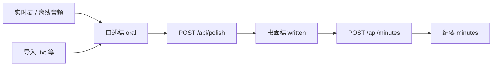

# base_Platform：文件上传与后续处理流程说明

本文档基于当前仓库 **`workspace/base_Platform`** 中已实现的前后端代码（`backend/app.py`、`frontend/src/main.tsx`），说明：**登录后用户能做什么、支持哪些文件类型、数据如何被加工、最终落库/落对象存储的形态**。  

> **范围说明**：下文描述的是 **ASR + LLM 加工 + MinIO + PostgreSQL `file_records`** 这条链路。仓库内另有 `services/wiki_writer.py`、`docs/SCHEMA_GRAPHRAG_IR_WORKSPACE.md` 等 **GraphRAG / Wiki 工作区** 设计材料，但 **当前 `app.py` 未接入 GraphRAG 索引任务**；若需「上传后自动跑 GraphRAG」，属于后续编排扩展，不在本节实现范围内。

---

## 1. 产品视角：当前实现了什么

| 能力 | 实现位置（概要） |
|------|------------------|
| 用户注册 / 登录 / JWT | `POST /api/auth/register`、`/api/auth/login`，前端请求带 `Authorization: Bearer …` |
| 实时语音采集与流式转写 | WebSocket `WS /ws/asr`（PCM16），WeNet Paraformer 本地推理 |
| 离线音频 → 文本 | `POST /api/transcribe`（multipart 上传音频文件） |
| 口语稿 → 书面稿（LLM） | `POST /api/polish`（DeepSeek 兼容 Chat Completions） |
| 书面稿 → 结构化纪要（LLM） | `POST /api/minutes` |
| 基于 MinIO 中选中文件的对话 | `POST /api/chat`（将选中对象预览拼进用户消息） |
| 对象存储与索引 | MinIO（S3 兼容）+ PostgreSQL 表 **`file_records`** |
| MinIO 浏览与文本预览 | `GET /api/minio/tree`、`GET /api/minio/object` |
| 上传记录查询 | `GET /api/files/records` |

环境依赖要点：

- **`FILE_INDEX_DATABASE_URL`**：必填，供 `FileRecordStore` 与 `UserStore` 连接 PostgreSQL（应用启动即连接）。
- **`MINIO_*`**：对象存储 endpoint 与密钥。
- **ASR**：`paraformer_model/`（或 `MODEL_DIR`）+ `MODEL_DEVICE`。
- **LLM**：默认 DeepSeek；可通过 `POST /api/llm/config` 在运行时改 `base_url` / `model` / `api_key`。

单文件大小上限：**`MAX_UPLOAD_MB`**（默认 80，见 `app.py`）。

---

## 2. 「上传」在代码里的几种含义

本项目中「上传」不是单一接口，而是多条路径：

1. **浏览器选择文件 → 只读入前端状态（不一定调用后端）**  
2. **调用后端 API → 转写 / 存 MinIO / 写 `file_records`**  
3. **WebSocket 实时音频 → 本地 `recordings/*.wav` → 再按需 POST 上传到 MinIO**

下面按类型拆开说明。

---

## 3. 支持的文件类型与前后端约束

### 3.1 文本类（导入到「口述稿 / 书面稿 / 纪要稿」）

**前端**（`main.tsx`）文件选择器声明：

- `accept=".txt,.md,.json,.csv,.log"`

**实际处理**：使用浏览器 `file.text()` **按 UTF-8 解码读成字符串** 填入对应编辑区。  
若文件为 **GBK 等编码**，可能出现乱码；后端并未在此环节参与解码。

**后端「上传」**：用户点击「导出/上传」时，走 `POST /api/upload/text`，请求体为 JSON：

- `kind`: **`raw`** | **`formal`** | **`minutes`**
- `content`: 完整文本  

服务端将 UTF-8 字节写入 MinIO，**扩展名固定为 `.txt`**，`Content-Type` 为 `text/plain; charset=utf-8`。

### 3.2 离线音频（转写，不一定立刻存 MinIO）

**前端** `accept`：`audio/*` 以及 `.wav,.mp3,.flac,.m4a,.aif,.aiff`

**后端** `POST /api/transcribe` **白名单后缀**：

- `.wav`, `.flac`, `.aiff`, `.aif`, `.mp3`, `.m4a`

流程：multipart 上传 → `Transcriber.transcribe_bytes`（WeNet）→ 返回 `{"text": "..."}`。  
**该接口不写 MinIO**；文本进入前端「口述稿」状态，由用户再决定是否「上传文本」或「一键上传」。

### 3.3 客户端直传音频到 MinIO

**`POST /api/client/upload/audio`**：multipart 字段 `audio`，后缀与 `/api/transcribe` 相同；校验空文件与大小后 **`put_object` 到 MinIO**，并写入 `file_records`（`kind` 仍为 `recording_wav`，与扩展名无关）。  

适用于 App/脚本直接推录音文件到平台的场景。

### 3.4 实时录音 → WAV 文件 → 再上传 MinIO

WebSocket `stop` 时，`StreamManager.save_full_recording` 将会话缓冲合并为 **`recordings/recording_YYYYMMDD_HHMMSS_<uuid>.wav`**（本地磁盘）。

随后用户可调用：

- **`POST /api/upload/recording`**：`{"session_id": "<ws 返回的 session_id>"}` — 上传该会话最近一次保存的 WAV。  
- **`POST /api/upload/recording/latest`**：无 session 时，上传 `recordings/` 下 **修改时间最新** 的 `*.wav`。

对象键形如：`recordings/YYYYMMDD_HHMMSS_<uuid>.wav`，`Content-Type`: `audio/wav`。

### 3.5 图片（仅前端引用，不上传对象存储）

**前端** `accept="image/*"`，处理函数 **`insertImageReference`**：  
在「口述稿」末尾追加一行 **纯文本**，包含时间、文件名、大小（KB）。  

**不调用后端**、**不写入 MinIO**、**不参与 ASR**。若需要真正的图像存储或多模态理解，需另行开发。

### 3.6 SOP / 聊天侧文本文件

代码中存在 `uploadTypedFile(..., "sop")` 分支：将文件内容写入 **`chatInput`**（聊天输入框），并非三栏加工流程的一部分。前端若未挂载对应按钮，该分支可能未被 UI 暴露。

---

## 4. 加工流水线：从原始输入到三种「稿」

典型顺序（与 UI 一致）：

### 4.1 实时 ASR（`WS /ws/asr`）

1. 客户端发 `{"type":"start", "config": {...}}` → 服务端创建 `StreamSession`，返回 `session_id` 与 `sample_rate`。  
2. 客户端持续发 `{"type":"audio","pcm16":"<base64>"}`。  
3. `StreamManager.process_audio`：基于 RMS、静音时长、最长句长等 **切分 utterance**，对每个片段调用 **`transcriber.transcribe_array`**。  
4. 服务端推送 `{"type":"transcript","text":"..."}`。  
5. `stop` 时：`flush_remaining`、**保存完整 WAV** 到 `recordings/`，并 `stopped` 消息中带 `recording_path`。

限制：`MAX_RECORDING_BUFFER_S`（默认 180s）内保留的整段缓冲用于生成 WAV，超出部分会截断（见日志提示）。

### 4.2 离线转写（`POST /api/transcribe`）

音频字节写入临时文件 → WeNet `transcribe`（或 soundfile + 回退路径）→ 返回单一字符串。

### 4.3 书面稿（`POST /api/polish`）

- System prompt：中文编辑，将口语转书面，去赘语、不篡改事实与数字。  
- User：`req.text`（口述稿全文）。  
- 返回：`{"text": "<LLM 输出>"}`。

### 4.4 纪要（`POST /api/minutes`）

- System prompt：会议秘书风格，结构化要点、结论、行动项、风险等。  
- User：**书面稿**全文（前端从 `processState.written` 发送）。  
- 返回：`{"text": "<LLM 输出>"}`。

### 4.5 对话加工（`POST /api/chat`）

请求体 `messages` 为 OpenAI 风格消息列表。前端在发送用户句时，若已选中 MinIO 对象，会把 **`/api/minio/object` 返回的 `preview` 截断至约 12000 字符** 拼入当前用户内容，便于模型结合「当前文件」作答。  

**注意**：`decode_preview` 对音频/图片仅返回说明性占位文本，**不会**把二进制解码为感知内容。

---

## 5. 写入 MinIO 与 PostgreSQL 后的「长什么样」

### 5.1 MinIO 桶与对象键

- 首次需要存储时调用 **`ensure_bucket()`**：创建形如 **`asr-YYYYMMDD-HHMMSS`** 的桶，并在进程内缓存为 **`current_bucket`**（全局单例式「当前桶」）。  
- 对象键前缀与类型：

| 业务 | 键前缀目录 | 文件扩展名 | Content-Type（典型） |
|------|------------|------------|----------------------|
| 录音 | `recordings/` | `.wav` 或客户端上传的 `ext` | `audio/wav` 或推断 |
| 口述稿 | `raw_transcript/` | `.txt` | `text/plain; charset=utf-8` |
| 书面稿 | `formal_text/` | `.txt` | 同上 |
| 纪要 | `meeting_minutes/` | `.txt` | 同上 |

键名：`{prefix}/YYYYMMDD_HHMMSS_{8位hex}.txt`（或录音对应扩展名）。

### 5.2 `file_records` 表（后端自动建表）

应用启动时执行 `CREATE TABLE IF NOT EXISTS file_records`（见 `FileRecordStore._init_schema`），主要字段：

- `bucket_name`, `object_key`（唯一约束）  
- `kind`：`recording_wav` | `raw_transcript` | `formal_text` | `meeting_minutes`  
- `content_type`, `byte_length`, `local_path`（录音上传时可为服务器上 WAV 路径）  
- `session_id`：WebSocket 会话上传录音时写入；纯文本上传为 `NULL`  
- `created_at` / `updated_at`

查询：`GET /api/files/records?session_id=&bucket=&kind=&limit=`。

### 5.3 一键上传（`POST /api/upload/all`）

请求体可含 `session_id`、`raw`、`formal`、`minutes` 字符串：

- 有 `session_id` 时尝试上传该会话录音（失败则记入 `errors`）。  
- 非空字段分别触发三类文本上传。  

响应：`{"results": [...], "errors": [...]}`，单项成功体包含 `bucket`、`key`（及 `type`）。

---

## 6. 浏览与预览形态

- **`GET /api/minio/tree`**：列出所有桶及桶内全部 key（分页 1000 循环拉取）。  
- **`GET /api/minio/object?bucket=&key=`**：拉取对象字节，再 **`decode_preview`**：  
  - `.txt/.md/.json/.csv/.log`：依次尝试 utf-8、gbk、utf-16 解码为字符串预览；  
  - 音频/图片：返回 **不可播放/不可渲染** 的说明文本；  
  - 其他：二进制前 2000 字节的 `repr` 风格片段。

前端树选中文件后，预览区展示上述 `preview` 字符串。

---

## 7. 小结表：用户动作 → 后端效果

| 用户动作 | 是否写 MinIO | 是否写 `file_records` | 产出形态 |
|----------|--------------|------------------------|----------|
| 实时说话（WS） | 否 | 否 | 流式 transcript 文本；stop 后本地 WAV |
| 上传录音到 MinIO | 是 | 是 | `recordings/*.wav` |
| 离线音频转写 | 否 | 否 | JSON `text` → 前端口述稿 |
| 客户端 `upload/audio` | 是 | 是 | `recordings/*.{wav\|mp3\|...}` |
| 上传口述/书面/纪要文本 | 是 | 是 | `*_transcript` 等前缀下 `.txt` |
| 导入图片 | 否 | 否 | 口述稿中一行引用文字 |
| Polish / Minutes | 否 | 否 | 前端状态更新；持久化需用户再点上传 |
| Chat | 否 | 否 | 即时 LLM 回复 |

---

## 8. 代码入口索引

| 模块 | 路径 |
|------|------|
| HTTP / WS 路由与存储 | `backend/app.py` |
| ASR | `backend/transcriber.py`（WeNet） |
| 前端 API 与文件选择 | `frontend/src/main.tsx` |
| 功能清单（简版） | `README.md` |

---

*文档随 `base_Platform` 当前实现编写；若增加 GraphRAG、Wiki 落盘或新 MIME 校验，请同步更新本节与接口列表。*
