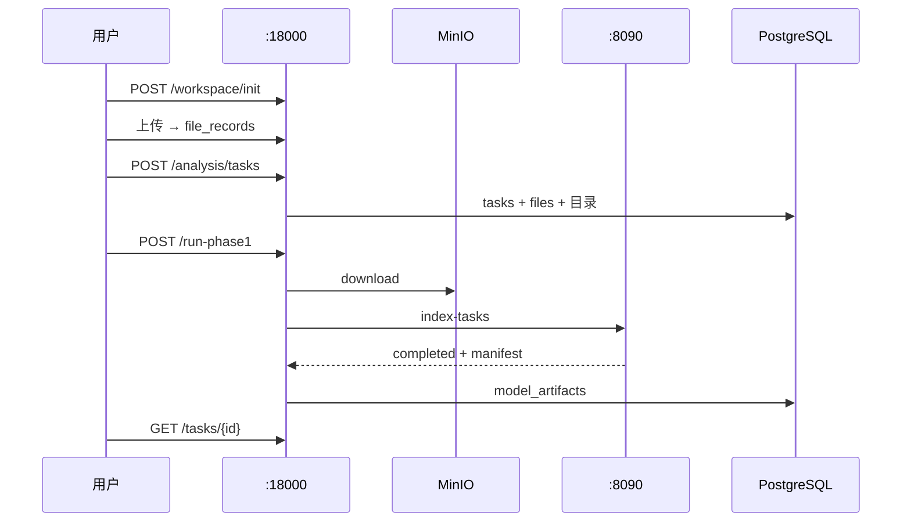

# 项目改造与运维操作记录

> **用途**：记录 base_Platform 从 ASR/上传平台扩展为「知识分析平台」的**具体操作**、脚本与接口行为。  
> **总册**：[`workspace/docs/PROJECT_FULL_GUIDE_ZH.md`](../../docs/PROJECT_FULL_GUIDE_ZH.md)

---

## 一、总体目标与完成范围

| 能力 | 状态 |
|------|------|
| PostgreSQL `ltt_craft` @ :5434 | ✅ |
| 9 张 GraphRAG/IR/Wiki 扩展表 | ✅ |
| Wiki 模板 + workspace init | ✅ |
| 分析任务创建 + 文件绑定 | ✅ |
| MinIO staging → inputs/ | ✅ |
| 8090 GraphRAG 索引 | ✅ |
| model_artifacts + 任务状态 | ✅ |
| 前端触发 Phase1 | ⬜ |
| CRR / IR / Wiki 自动写 | ⬜ |

---

## 二、运维与环境

### 2.1 PostgreSQL

```bash
cd /mnt/dockerContainerSave/memory/ltt/workspace/base_Platform
docker compose -f docker-compose.ltt-pg.yml up -d
docker exec ltt-craft-pg pg_isready -U craft -d ltt_craft
```

连接串（`.env`）：

```text
postgresql://craft:<password>@127.0.0.1:5434/ltt_craft
```

### 2.2 扩展表迁移

```bash
psql "$FILE_INDEX_DATABASE_URL" -f database/schema_graphrag_ir_workspace.sql
```

DDL 说明：[`SCHEMA_GRAPHRAG_IR_WORKSPACE.md`](SCHEMA_GRAPHRAG_IR_WORKSPACE.md)。

### 2.3 环境变量

| 变量 | 说明 |
|------|------|
| `FILE_INDEX_DATABASE_URL` | 必填 |
| `GRAPHRAG_HTTP_BASE_URL` | 8090，如 `http://127.0.0.1:8090` |
| `MINIO_*` | 远程 MinIO；未配则用代码默认 |
| `JWT_SECRET` | 登录 token |

### 2.4 `.gitignore`

建议忽略 `workspace/projects/`（运行时 Wiki 与任务目录），避免大文件进 Git。

---

## 三、Wiki 模板与磁盘

- **模板源**：`backend/resources/wiki_template/base_wiki/`
- **运行时**：`workspace/projects/{project_slug}/`
- **初始化**：`POST /api/workspace/init`

详见 [`WIKI_WORKSPACE_TEMPLATE.md`](WIKI_WORKSPACE_TEMPLATE.md)。

---

## 四、数据库扩展（9 表）

| 表 | Phase1 使用 |
|----|-------------|
| `projects` | ✅ workspace_root |
| `analysis_tasks` | ✅ |
| `analysis_task_files` | ✅ |
| `model_artifacts` | ✅ |
| `analysis_task_events` | ✅ |
| `crr_snapshots` | 预留 |
| `candidate_ir_items` | 预留 |
| `ir_assets` | 预留 |
| `wiki_pages` | 预留 |

---

## 五、后端代码结构

```text
backend/
├── app.py                 # legacy + include_router
├── auth_users.py
├── transcriber.py
├── routers/
│   ├── workspace.py
│   ├── analysis_tasks.py
│   └── ir.py
├── services/
│   ├── analysis_*.py
│   ├── workspace_*.py
│   ├── graphrag_model_client.py
│   ├── minio_download.py
│   └── wiki_writer.py
├── repositories/
└── schemas/
```

`app.py` 改造要点：`load_env_file` 后再 `from .routers import ...`。

---

## 六、HTTP 接口详解

### 6.1 Workspace

**POST `/api/workspace/init`**

```json
{ "project_code": "PCG", "project_slug": "pcg", "project_name": "示例项目" }
```

- 从 `base_wiki` copytree 到 `workspace/projects/pcg/`
- 更新 `projects.workspace_root`

**GET `/api/workspace/tree?project_code=PCG`** — 返回 `wiki/` 树 JSON

**GET `/api/workspace/file?project_code=PCG&path=wiki/index.md`** — 读 wiki 文本（防路径穿越）

### 6.2 Analysis

**POST `/api/analysis/tasks`**

```json
{
  "project_code": "PCG",
  "skill_id": "default",
  "mode": "auto",
  "file_record_ids": [1]
}
```

**POST `/api/analysis/tasks/{id}/stage`** — 仅 MinIO → inputs/

**POST `/api/analysis/tasks/{id}/run-phase1?skip_staging=false`** — Step 4–7 编排

**GET `/api/analysis/tasks/{id}`** — 轮询 `status` / `progress` / `current_step`

### 6.3 IR 占位

**GET `/api/ir/overview`** — 返回 stub

---

## 七、典型业务流程



---

## 八、GraphRAG 子工程

| 路径 | 说明 |
|------|------|
| `workspace/graphrag/` | 引擎 monorepo + `graphragltt_env` |
| `qwen_graphrag_demo/` | settings/prompts/.env 模板 |
| `graphrag-model-service/` | 8090 FastAPI |
| `graphrag_runs/` | 每次索引运行根 |

8090 启动：`./scripts/start_graphrag_8090.sh`

---

## 九、文档清单

| 文档 | 路径 |
|------|------|
| 总册 | `workspace/docs/PROJECT_FULL_GUIDE_ZH.md` |
| 目录结构 | `docs/PROJECT_STRUCTURE.md` |
| 启动指南 | `docs/PHASE1_STARTUP_GUIDE_ZH.md` |
| 七步 API | `docs/PHASE1_GRAPHRAG_PIPELINE_ZH.md` |
| 验收 | `docs/PHASE1_ACCEPTANCE_TEST_ZH.md` |
| 8090 | `graphrag-model-service/docs/GRAPHRAG_MODEL_SERVICE_ZH.md` |

### 9.1 GraphRAG 引擎本地补丁

**问题**：`WorkflowProfiler` + `tracemalloc` 在 `create_base_text_units` 挂死。

**修改**：`workspace/graphrag/packages/graphrag/graphrag/index/run/profiling.py` — 仅保留计时。

**文档**：[`PHASE1_STARTUP_GUIDE_ZH.md` 八点一](PHASE1_STARTUP_GUIDE_ZH.md#八一-graphrag-workflowprofiler--tracemalloc-挂死2026-05-27)

---

## 十、启动脚本速查

| 脚本 | 说明 |
|------|------|
| `workspace/scripts/start_all.sh` | 全栈一键 |
| `scripts/start_graphrag_8090.sh` | 8090 |
| `scripts/sync_graphrag_settings.sh` | settings 同步 |
| `vllm-big-model/start_all.sh` | vLLM |

---

*版本：2026-06-03*
