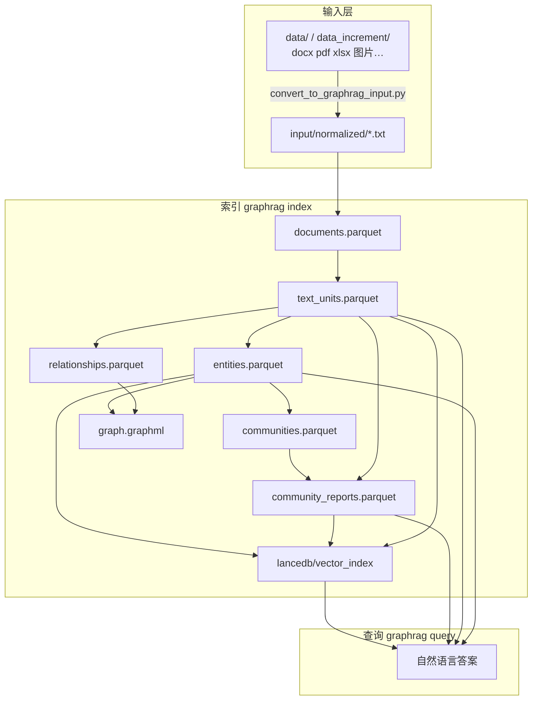

# GraphRAG 全链路技术说明（更新版）

> **适用范围**：`/mnt/dockerContainerSave/memory/ltt/workspace/graphrag`（Microsoft GraphRAG **3.0.8** monorepo + 本目录 `qwen_graphrag_demo` 演示工程）  
> **配置基准**：以当前 `settings.yaml` 为准（2026-05 同步自 qhq 仓库后版本）  
> **说明**：`README.md` 中仍描述「智谱 GLM + DashScope text-embedding-v3」为历史示例；**当前实际模型见下文 §3**。

---

## 目录

1. [系统总览](#1-系统总览)
2. [技术栈与环境](#2-技术栈与环境)
3. [模型与 API 配置](#3-模型与-api-配置)
4. [输入：文件从哪里来、长什么样](#4-输入文件从哪里来长什么样)
5. [阶段 0：多格式预处理（ingest）](#5-阶段-0多格式预处理ingest)
6. [阶段 1～9：GraphRAG 索引流水线](#6-阶段-19graphrag-索引流水线)
7. [存储结构与文件格式](#7-存储结构与文件格式)
8. [查询：输入输出与四种检索模式](#8-查询输入输出与四种检索模式)
9. [增量更新流程](#9-增量更新流程)
10. [辅助脚本与图谱导出](#10-辅助脚本与图谱导出)
11. [端到端数据流图](#11-端到端数据流图)
12. [运维与排错要点](#12-运维与排错要点)

---

## 1. 系统总览

GraphRAG 将**非结构化企业文档**转为可检索的知识结构，包含三层能力：

| 层次 | 产物 | 用途 |
|------|------|------|
| **文档层** | `documents.parquet`、`text_units.parquet` | 原文与分块，支撑块级向量检索 |
| **图谱层** | `entities.parquet`、`relationships.parquet`、`communities.parquet`、`graph.graphml` | 实体关系与社区结构 |
| **语义层** | `community_reports.parquet` + `output/lancedb/` | 社区摘要与多路向量，支撑 local/global/drift |

本演示工程的典型路径：

```text
data/*（多格式原件）
    → ingest/convert_to_graphrag_input.py
    → input/normalized/*.txt
    → graphrag index（9 个 workflow）
    → output/*.parquet + output/lancedb + graph.graphml
    → graphrag query（basic / local / global / drift）
```

**无内置 Web API**：运行方式为 CLI（`graphrag index` / `graphrag query`）+ Python 辅助脚本，不是 FastAPI 服务。

---

## 2. 技术栈与环境

### 2.1 仓库结构

| 路径 | 角色 |
|------|------|
| `packages/graphrag/` | 主库：CLI、索引编排、查询引擎 |
| `packages/graphrag-input/` | 读取 text/csv/json/jsonl/markitdown |
| `packages/graphrag-chunking/` | Token / 句子分块 |
| `packages/graphrag-storage/` | 文件/Blob/Cosmos + **Parquet 表** |
| `packages/graphrag-cache/` | JSON/内存 LLM 缓存 |
| `packages/graphrag-llm/` | **LiteLLM** 统一调用补全与嵌入 |
| `packages/graphrag-vectors/` | **LanceDB** / Azure AI Search 等 |
| `qwen_graphrag_demo/` | 本说明对应的**可运行演示**（配置、数据、脚本） |

### 2.2 Python 与虚拟环境

| 项 | 值 |
|----|-----|
| GraphRAG 要求 | **Python >=3.11, <3.14**（根 `pyproject.toml`） |
| 本仓库 venv | `graphrag/graphragltt_env/`，**Python 3.11.0** |
| 演示 README 建议 | Conda 环境名示例 `graphrag311` |

激活环境后需已安装 **graphrag** 包（`uv sync` 或 `pip install -e packages/graphrag`）。

### 2.3 核心依赖（索引与查询）

| 类别 | 库 | 用途 |
|------|-----|------|
| 数据 | `pandas~=2.3`、`pyarrow~=22`、`numpy~=2.1` | Parquet 表读写 |
| 图算法 | `networkx~=3.4`、`graspologic-native` | 社区发现、GraphML 导出 |
| LLM | `litellm==1.82.6`（经 graphrag-llm） | OpenAI 兼容网关调用 |
| 向量 | `lancedb~=0.24.1` | 本地向量库 |
| CLI | `typer`、`pydantic` | `graphrag` 命令行 |

### 2.4 预处理额外依赖

文件：`ingest/requirements.txt`

```text
markitdown[docx,pptx], pandas, pyarrow, PyYAML, openpyxl,
beautifulsoup4, pillow, pytesseract, openai, httpx
```

系统级（可选）：`tesseract-ocr`、`tesseract-ocr-chi-sim`（`--enable-ocr`）。

---

## 3. 模型与 API 配置

配置源：`qwen_graphrag_demo/settings.yaml`  
密钥通过环境变量注入（建议在项目根 `.env` 中设置）：

| 环境变量 | 用途 |
|----------|------|
| `LOCAL_API_KEY` | 补全 + 嵌入共用 |
| `LOCAL_CHAT_API_BASE` | Chat Completions（抽取、摘要、社区报告、查询） |
| `LOCAL_EMBEDDING_API_BASE` | Embeddings API（`/v1/embeddings`） |

预处理视觉（可选，与索引模型独立）：

| 环境变量 | 用途 |
|----------|------|
| `VISION_API_KEY` / `DASHSCOPE_API_KEY` | 图片 `--enable-vision` |
| `VISION_API_BASE` | 默认 DashScope 兼容端点 |

### 3.1 当前索引与查询使用的模型

| 角色 | 实现 | Provider | **模型名** | 关键参数 |
|------|------|----------|------------|----------|
| **补全**（抽取图、实体描述摘要、社区报告、查询回答） | `litellm` | `openai`（兼容网关） | **`qwen3-vl`** | `temperature: 0.1`，`max_tokens: 4096`，`timeout: 180` |
| **嵌入**（三路语义向量） | `litellm` | `openai`（兼容网关） | **`qwen3-embedding`** | `encoding_format: float`，`timeout: 120` |
| **视觉描述**（仅预处理，可选） | OpenAI 兼容 HTTP | DashScope 等 | 默认 **`qwen3.5-omni-plus-2026-03-15`** | 短 caption，`max_tokens` 默认 32 |

### 3.2 向量维度与 LanceDB

`vector_store.index_schema` 为以下三列均配置 **`vector_size: 1024`**，须与 `qwen3-embedding` 实际输出维度一致：

- `text_unit_text`
- `entity_description`
- `community_full_content`

首次 `graphrag index`（不加 `--skip-validation`）会做连通性测试，并在维度不一致时尝试对齐配置。

### 3.3 并发与限流

- `concurrent_requests: 1`：降低网关限流风险  
- `embed_text.batch_size: 10`：嵌入批大小  
- `extract_graph.max_gleanings: 0`：每个文本块只调用 **1 次** LLM 抽取（不做 CONTINUE 第二轮）

### 3.4 与上游 GraphRAG 默认的差异

`packages/graphrag/graphrag/config/init_content.py` 默认模板为 **gpt-4.1** + **text-embedding-3-large**；本演示已全部改为本地 OpenAI 兼容网关 + Qwen 系列模型。

---

## 4. 输入：文件从哪里来、长什么样

### 4.1 原始输入（业务层）

| 目录 | 含义 |
|------|------|
| `data/` | 全量原始资料 |
| `data_increment/` | 增量原始资料 |

支持扩展名（由 `ingest/convert_to_graphrag_input.py` 处理）：

| 类型 | 扩展名 | 处理方式 |
|------|--------|----------|
| 纯文本 | `.txt`、`.md` | 直接读取（多编码回退） |
| 网页 | `.html`、`.htm` | BeautifulSoup 提取可见文本 |
| 表格 | `.csv`、`.xlsx`、`.xls` | 按行展平为 `key=value` 文本 |
| Office / PDF | `.pdf`、`.pptx`、`.docx` | **markitdown** 转 Markdown 式文本 |
| 图片 | `.png`、`.jpg`、`.jpeg`、`.webp` | 可选 OCR + 可选多模态简述 |

### 4.2 GraphRAG 索引输入（引擎层）

| 配置项 | 当前值 |
|--------|--------|
| `input.type` | `text` |
| `input_storage.base_dir` | `input` |
| `input.file_pattern` | `.*/normalized/.*\\.txt` |

**只有** `input/normalized/`（及增量子目录 `input/normalized/increment_*`）下符合模式的 `.txt` 会进入索引，避免误索引旧 demo 文件。

### 4.3 标准化 txt 文件格式（预处理输出）

每个文件大致结构：

```text
--- metadata ---
source_path: data/xxx/文件.pdf
source_name: 文件.pdf
converted_at: 2026-05-11T...
ocr: true|false
vision: true|false
--- end metadata ---

（正文：转换后的纯文本，供分块与 LLM 抽取）
```

读取后变为 `TextDocument`：

| 字段 | 生成方式 |
|------|----------|
| `id` | 内容哈希 |
| `title` | 文件名（用于增量合并识别） |
| `text` | 元数据头 + 正文 |
| `creation_date` | 文件系统时间等（见增量说明） |

---

## 5. 阶段 0：多格式预处理（ingest）

**脚本**：`ingest/convert_to_graphrag_input.py`  
**命令示例**：

```bash
python ingest/convert_to_graphrag_input.py \
  --source-dir ./data \
  --target-dir ./input/normalized \
  --enable-ocr \
  --enable-vision
```

| 步骤 | 输入 | 处理 | 输出 |
|------|------|------|------|
| 扫描 | `--source-dir` 下递归文件 | 按扩展名路由转换器 | — |
| 转换 | 各格式原件 | markitdown / pandas / BS4 / OCR / Vision API | 单文件 `.txt` |
| 写入 | — | 附加 metadata 头 | `input/normalized/<相对路径>.txt` |

**输出**：仅文本文件，**不**产生 Parquet 或向量；下一步由 `graphrag index` 完成。

---

## 6. 阶段 1～9：GraphRAG 索引流水线

### 6.1 编排入口

```bash
cd qwen_graphrag_demo
graphrag index              # 含配置自检
graphrag index --skip-validation   # 跳过连通性/维度自检，少打 API
```

调用链：

```text
graphrag index
  → graphrag/api/index.py :: build_index()
  → PipelineFactory.create_pipeline(config)
  → index/run/run_pipeline.py :: run_pipeline()
```

当前 `settings.yaml` **显式覆盖**内置流水线（`config.workflows` 非空时完全替换默认 Standard 列表）：

```yaml
workflows:
  - load_input_documents
  - create_base_text_units
  - create_final_documents
  - extract_graph
  - finalize_graph
  - create_communities
  - create_final_text_units
  - create_community_reports
  - generate_text_embeddings
```

未启用：`extract_graph_nlp`（英文 regex 名词短语，中文常无边）、`prune_graph`、`extract_covariates`（claims）。

### 6.2 分块参数

| 参数 | 值 |
|------|-----|
| `chunking.type` | `tokens` |
| `chunking.size` | **1200** tokens |
| `chunking.overlap` | **100** tokens |
| `chunking.encoding_model` | `o200k_base` |

实现包：`graphrag-chunking`（TokenChunker）。

### 6.3 逐步详解

#### 步骤 1：`load_input_documents`

| 项 | 说明 |
|----|------|
| **输入** | `input/` 下匹配 `file_pattern` 的 `.txt` |
| **处理** | `TextFileReader` 逐文件读入，构造文档表 |
| **输出文件** | `output/documents.parquet`（初版） |
| **主要列** | `id`, `human_readable_id`, `title`, `text`, `creation_date` |

#### 步骤 2：`create_base_text_units`

| 项 | 说明 |
|----|------|
| **输入** | `documents.parquet` |
| **处理** | 按 1200/100 token 切分为 **text unit**（块） |
| **输出文件** | `output/text_units.parquet`（中间态） |
| **主要列** | `id`, `text`, `n_tokens`, `document_id`, … |

#### 步骤 3：`create_final_documents`

| 项 | 说明 |
|----|------|
| **输入** | 中间 `text_units` + `documents` |
| **处理** | 建立文档 ↔ 文本块映射 |
| **输出文件** | 覆盖 `output/documents.parquet`（终态） |
| **新增关联** | `text_unit_ids`（文档包含哪些块） |

#### 步骤 4：`extract_graph`（LLM 图抽取，耗时最长）

| 项 | 说明 |
|----|------|
| **输入** | 每个 `text_unit.text` |
| **模型** | **`qwen3-vl`**，prompt：`prompts/extract_graph.txt` |
| **处理** | 每块调用 LLM 抽取实体与关系 → 合并去重 → `summarize_descriptions` 压缩描述 |
| **实体类型** | `organization`, `person`, `geo`, `event` |
| **输出文件** | `output/entities.parquet`、`output/relationships.parquet`（原始合并表） |

实体表终态列（`schemas.py`）：`id`, `human_readable_id`, `title`, `type`, `description`, `text_unit_ids`, `frequency`, `degree`  

关系表终态列：`id`, `human_readable_id`, `source`, `target`, `description`, `weight`, `combined_degree`, `text_unit_ids`

#### 步骤 5：`finalize_graph`

| 项 | 说明 |
|----|------|
| **输入** | entities + relationships |
| **处理** | 计算度、频率等图统计；可选导出 GraphML |
| **输出文件** | 更新 `entities.parquet`、`relationships.parquet`；**`output/graph.graphml`**（`snapshots.graphml: true`） |

#### 步骤 6：`create_communities`

| 项 | 说明 |
|----|------|
| **输入** | 终态 entities + relationships |
| **处理** | **Leiden** 社区发现（`cluster_graph.max_cluster_size: 10`） |
| **输出文件** | `output/communities.parquet` |
| **主要列** | `community`, `level`, `parent`, `children`, `entity_ids`, `relationship_ids`, `text_unit_ids`, … |

#### 步骤 7：`create_final_text_units`

| 项 | 说明 |
|----|------|
| **输入** | text_units + entities + relationships |
| **处理** | 为每个块挂上 `entity_ids`、`relationship_ids` |
| **输出文件** | 覆盖 `output/text_units.parquet`（终态） |

#### 步骤 8：`create_community_reports`

| 项 | 说明 |
|----|------|
| **输入** | communities + 子图上下文 |
| **模型** | **`qwen3-vl`**，prompt：`prompts/community_report_graph.txt` |
| **处理** | 为每个社区生成结构化报告（摘要、发现等） |
| **输出文件** | `output/community_reports.parquet` |
| **主要列** | `community`, `title`, `summary`, `full_content`, `findings`, `rank`, `full_content_json`, … |

**说明**：无此表则无法使用 `--method local` / `global` / `drift`。

#### 步骤 9：`generate_text_embeddings`

| 项 | 说明 |
|----|------|
| **输入** | 见下表「嵌入源字段」 |
| **模型** | **`qwen3-embedding`**，`batch_size: 10` |
| **输出** | `output/lancedb/`（Lance 表，默认索引名 **`vector_index`**，IVF_FLAT） |

| `embed_text.names` | 嵌入源 | 查询用途 |
|--------------------|--------|----------|
| `text_unit_text` | `text_units.text` | **basic** 块检索 |
| `entity_description` | 实体 `title` + `description` 拼接 | **local** / **drift** 实体语义 |
| `community_full_content` | `community_reports.full_content` | **local** / **global** / **drift** 社区语义 |

`snapshots.embeddings: false`：向量**不**写入 Parquet，仅存 LanceDB。

### 6.4 每轮运行元数据

| 文件 | 内容 |
|------|------|
| `output/stats.json` | 总耗时、文档数、各 workflow 耗时与内存 |
| `output/context.json` | 流水线状态上下文 |
| `logs/indexing-engine.log` | 详细索引日志 |

示例（当前库）：35 篇文档，`extract_graph` 约 2068s，总时长约 2946s（见 `output/stats.json`）。

---

## 7. 存储结构与文件格式

### 7.1 存储拓扑

```text
qwen_graphrag_demo/
├── input/                    # input_storage（只读输入）
│   └── normalized/*.txt
├── output/                   # output_storage（索引产物）
│   ├── *.parquet
│   ├── graph.graphml
│   ├── lancedb/
│   ├── context.json
│   └── stats.json
├── cache/                    # LLM 调用 JSON 缓存
│   ├── text_embedding/
│   ├── community_reporting/
│   └── extract_graph/ …
├── logs/                     # reporting
└── prompts/                  # 各阶段 prompt 模板
```

### 7.2 Parquet 表一览

| 文件 | 何时生成 | 持久化内容 |
|------|----------|------------|
| `documents.parquet` | 步骤 1、3 | 文档全文 + `text_unit_ids` |
| `text_units.parquet` | 步骤 2、7 | 分块文本 + 关联实体/关系 ID |
| `entities.parquet` | 步骤 4、5 | 知识图谱节点 |
| `relationships.parquet` | 步骤 4、5 | 知识图谱边 |
| `communities.parquet` | 步骤 6 | 社区层次结构 |
| `community_reports.parquet` | 步骤 8 | LLM 社区摘要（local/global 必需） |
| `covariates.parquet` | 仅 `extract_claims.enabled: true` | 当前 **关闭** |

存储实现：`graphrag-storage` → `ParquetTable` 写入 `{name}.parquet`。

### 7.3 LanceDB 向量库

| 项 | 值 |
|----|-----|
| 路径 | `output/lancedb/` |
| 配置 | `vector_store.type: lancedb`，`db_uri: output/lancedb` |
| 维度 | **1024**（三路 schema 一致） |
| 索引类型 | IVF_FLAT |

向量行与 Parquet 中 `id` 对应，用于查询时语义检索。

### 7.4 GraphML

- 路径：`output/graph.graphml`
- 内容：实体为节点、关系为边（NetworkX 导出）
- 用途：`visualize_graph.py` 出图；**Neo4j 导入推荐用 parquet**（字段更全）

### 7.5 LLM 缓存

| 项 | 值 |
|----|-----|
| 类型 | `cache.type: json` |
| 目录 | `cache/` |
| 机制 | 请求内容 hash → `*_v4` 文件，避免重复计费 |

换模型或改 `max_tokens` 后若结果异常，应 **`rm -rf cache`** 再重建索引。

---

## 8. 查询：输入输出与四种检索模式

### 8.1 查询输入

```bash
graphrag query "你的自然语言问题" --method <模式> [-d <output_dir>]
```

| 参数 | 说明 |
|------|------|
| 问题字符串 | 用户 query |
| `--method` | `basic` \| `local` \| `global` \| `drift` |
| `-d` | 可选，指向 `output/` 或增量 `…/delta/` |

引擎从指定目录加载 Parquet + LanceDB，再调用 **`qwen3-vl`** 生成最终答案。

### 8.2 各模式依赖与行为

| 模式 | 必需产物 | 检索逻辑概要 | 输出 |
|------|----------|--------------|------|
| **basic** | `text_units` + `text_unit_text` 向量 | 向量 Top-K 文本块 + LLM 综合回答 | 自然语言答案（stdout / `logs/query.log`） |
| **local** | 实体、关系、社区、**community_reports** + 多路向量 | 以实体为中心扩展邻域与社区上下文 | 同上 |
| **global** | 实体、社区、**community_reports**（**可不依赖向量库**） | Map：按社区报告分片 → Reduce 归约 | 同上 |
| **drift** | 同 local + DRIFT 状态机 | 多轮跟随式局部搜索 | 同上 |

配置节：`basic_search`（`k: 100`, `max_context_tokens: 24000`）、`local_search`、`global_search`、`drift_search`，prompt 在 `prompts/` 下对应 txt 文件。

### 8.3 查询输出

- **主输出**：终端打印的 **Markdown/纯文本回答**（由 LLM 根据检索上下文生成）
- **副作用**：`logs/query.log` 记录检索与调用过程
- **不默认写入**新的 Parquet；查询为只读消费 `output/`

---

## 9. 增量更新流程

**脚本**：`incremental_update.py`

```bash
python incremental_update.py \
  --source-dir ./data_increment \
  --run-update \
  --skip-validation \
  --enable-vision
```

| 阶段 | 说明 |
|------|------|
| 预处理 | 新文件 → `input/normalized/increment_<时间戳>/` |
| `graphrag update` | 旧 `output/` 备份到 `previous/`，增量结果写入 `update_output/<ts>/delta/` |
| 合并 | `delta/` 为**整库快照**（主库 + 增量），非仅增量片段 |

查询增量库：

```bash
graphrag query "问题" --method basic \
  -d ./output_increment_<时间戳>/<运行批次>/delta
```

**`creation_date` 语义**：新文档多用文件 `st_ctime`；已存在同 `title` 的文档从 `previous` 合并时**不**改创建时间。按时间清理向量见 `purge_stale_vectors.py`（§10）。

---

## 10. 辅助脚本与图谱导出

| 脚本 | 功能 |
|------|------|
| `ingest/convert_to_graphrag_input.py` | 多格式 → normalized txt |
| `incremental_update.py` | 增量预处理 + update |
| `export_to_neo4j.py` | parquet → Neo4j `:Entity` / `:RELATED` |
| `visualize_graph.py` | graphml → PNG / Pyvis HTML |
| `purge_stale_vectors.py` | 按 `creation_date` 清理 LanceDB 向量 |
| `record_run_manifest.py` | 生成 `run_manifest_*.json` 运行清单 |
| `quality_check.py` / `clean_graph_inputs.py` | 质量检查与输入清洗 |

---

## 11. 端到端数据流图



---

## 12. 运维与排错要点

| 现象 | 建议 |
|------|------|
| `No entities detected` + 高 `cache_hit_rate` | 删除 `cache/` 后重跑；检查历史 `max_tokens` 过小导致的截断缓存 |
| `Could not find community_reports.parquet` | 确认 `workflows` 含 `create_community_reports` 并全量 `graphrag index` |
| `batch size … larger than 10` | 将 `embed_text.batch_size` 设为 **10** |
| 换嵌入模型或维度 | 修改 `vector_size`，**删除 `output/` 与 `cache/`** 后全量重建 |
| `settings.yaml` 第 185 行 `ext_tokens` | 疑似 YAML 笔误，建议改为注释或并入 `drift_search.max_context_tokens` |
| README 与 settings 模型不一致 | 以 **本文 §3** 与 **`settings.yaml`** 为准 |
| `run-phase1` / `graphrag index` 卡在 `create_base_text_units`、3600s 超时 | 本地 **`WorkflowProfiler` + tracemalloc** 挂死；见 [`PHASE1_STARTUP_GUIDE_ZH.md`](../base_Platform/docs/PHASE1_STARTUP_GUIDE_ZH.md#八一-graphrag-workflowprofiler--tracemalloc-挂死2026-05-27) 与 `graphrag/.../index/run/profiling.py` 补丁 |

---

## 附录 A：命令速查

```bash
# 环境
source /mnt/dockerContainerSave/memory/ltt/workspace/graphrag/graphragltt_env/bin/activate
# 或: conda activate graphrag311
cd /mnt/dockerContainerSave/memory/ltt/workspace/graphrag/qwen_graphrag_demo
pip install -r ingest/requirements.txt

# 全量
python ingest/convert_to_graphrag_input.py \
  --source-dir ./data --target-dir ./input/normalized \
  --enable-ocr --enable-vision
graphrag index --skip-validation
graphrag query "你的问题" --method local
python record_run_manifest.py --pretty

# 增量
python incremental_update.py --source-dir ./data_increment --run-update --skip-validation
graphrag query "问题" --method basic -d ./output_increment_*/<批次>/delta
```

---

## 附录 B：关键源码索引

| 主题 | 路径 |
|------|------|
| 演示配置 | `qwen_graphrag_demo/settings.yaml` |
| 流水线工厂 | `packages/graphrag/graphrag/index/workflows/factory.py` |
| 执行引擎 | `packages/graphrag/graphrag/index/run/run_pipeline.py` |
| 数据列契约 | `packages/graphrag/graphrag/data_model/schemas.py` |
| 查询工厂 | `packages/graphrag/graphrag/query/factory.py` |
| 预处理 | `qwen_graphrag_demo/ingest/convert_to_graphrag_input.py` |
| 官方配置文档 | https://microsoft.github.io/graphrag/config/yaml/ |

---

*文档版本：与 graphrag 3.0.8 + qwen_graphrag_demo 当前 settings 同步。修改模型或 workflows 后请同步更新本文 §3、§6。*
