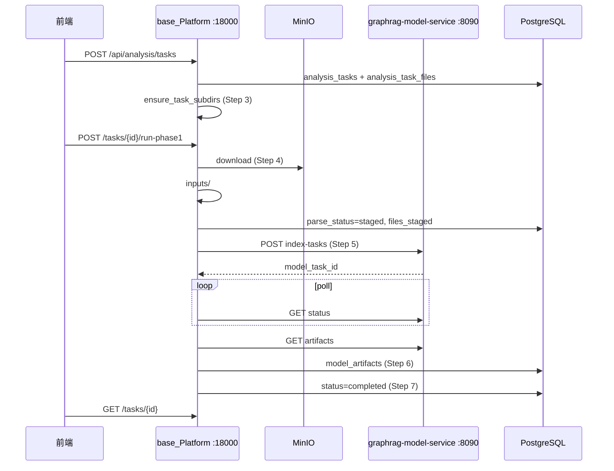

# 阶段一：分析任务 7 步后端流水线

> **专册说明**：本文是 [`PROJECT_FULL_GUIDE_ZH.md`](PROJECT_FULL_GUIDE_ZH.md) 第十一节的展开版。  
> **同步副本**：[`base_Platform/docs/PHASE1_GRAPHRAG_PIPELINE_ZH.md`](../base_Platform/docs/PHASE1_GRAPHRAG_PIPELINE_ZH.md)（含启动/8090/验收扩展节）。  
> 代码根目录：`workspace/base_Platform/backend/`。

---

## 一、目标与范围

**阶段一目标**：用户选定 `file_records` 后，平台完成：

1. 建任务与磁盘目录；
2. 从 MinIO 拉原始文件到任务目录；
3. 调用 GraphRAG HTTP 服务建索引；
4. 把 manifest 写入 `model_artifacts` 并更新任务状态。

**本阶段不做**：RR/CRR/IR 生成、Wiki 自动写入、`crr_snapshots` / `candidate_ir_items` 等业务（表已预留，代码未接）。

**主要用到的表**：`analysis_tasks`、`analysis_task_files`、`model_artifacts`、`analysis_task_events`。

---

## 二、方案评审（是否合理）

| 设计点 | 结论 | 结合本项目的说明 |
|--------|------|------------------|
| 拆成 7 个后端动作 | ✅ 合理 | Step 1–3 在 `POST /api/analysis/tasks` 一次完成；Step 4 可单独 `POST .../stage`；Step 4–7 可 `POST .../run-phase1` 编排 |
| `inputs/` 与 `graphrag_input/` 分离 | ✅ 合理 | `inputs/` 存 docx/pdf 等原始副本；normalized txt 在 8090 的 `graphrag_runs/{id}/input/normalized/`，完成后回填 `graphrag_input_path` |
| 保留 `parsed/` | ✅ 可接受 | 与 `graphrag_input` 本阶段可同路径；便于第二阶段若平台侧自行解析 |
| 新增 `graphrag_out/` | ✅ 合理 | 存 `artifact_manifest.json` 与 `graphrag_service_task_root.txt`，便于按 `task_id` 归档与清理 |
| base_Platform 下载 MinIO，8090 只读本地路径 | ✅ 合理（第一版） | MinIO 凭证仅在 `app.py` / `minio_download.py`；8090 无 MinIO 依赖 |
| 不让 GraphRAG 服务直接读 MinIO | ✅ 合理 | 降低权限边界与联调成本；代价是**两进程须能访问同一 `local_path`** |
| `AnalysisFilePrepareService` 只做 staging | ✅ 已实现 | 不做 PDF/Word 转 txt，归 8090 `prepare_normalized_inputs` |
| Step 7 前端刷新 | ✅ 合理 | 后端写 `analysis_tasks.status/progress`；前端轮询 `GET /api/analysis/tasks/{id}` |

**需注意的差异**：

- 8090 实际输出在 `graphrag-model-service/graphrag_runs/{model_task_id}/output/`，**不是**直接写在平台的 `graphrag_out/`；平台目录存 **manifest 副本 + 指向 8090 根路径的文本文件**。
- `run-phase1` 为**同步 HTTP**（内部轮询至完成），长任务会占用连接；后续应改 Worker。

---

## 三、七步动作映射

| Step | 动作 | HTTP / 代码 | 表与磁盘 |
|------|------|-------------|----------|
| **1** | 创建 `analysis_tasks` | `POST /api/analysis/tasks` → `AnalysisTaskService.create_task_with_files` | `analysis_tasks`（`status=pending`） |
| **2** | 创建 `analysis_task_files` | 同上，遍历 `file_record_ids` | 每文件一行，`parse_status=pending`，带 `minio_bucket/key` |
| **3** | 创建任务目录 | `WorkspacePathService.ensure_task_subdirs` | 见 [第四节](#四任务目录结构) |
| **4** | 文件 staging | `POST /api/analysis/tasks/{id}/stage` → `AnalysisFilePrepareService.stage_files` | `inputs/{id}_{name}`；`local_path`；`parse_status=staged`；event `files_staged` |
| **5** | 调用 GraphRAG HTTP | `AnalysisPipelineService.run_phase1` → `GraphragModelClient` | `analysis_tasks.model_task_id`；8090 `graphrag_runs/{id}/` |
| **6** | 写 `model_artifacts` | `ArtifactRepository.upsert_from_manifest` | manifest JSON + 路径列；`graphrag_out/artifact_manifest.json` |
| **7** | 更新任务状态 | `update_analysis_task_status` + event `phase1_completed` | `status=completed`，`progress=100`；失败则 `failed` + `phase1_failed` |

### 推荐 API 调用顺序



```text
POST /api/analysis/tasks
    body: { project_code, skill_id, mode, file_record_ids[] }
    → Step 1–3

POST /api/analysis/tasks/{task_id}/stage          # 可选：仅 Step 4
    → MinIO → inputs/

POST /api/analysis/tasks/{task_id}/run-phase1     # Step 4–7（默认先 stage）
    query: skip_staging=false|true

GET  /api/analysis/tasks/{task_id}                # Step 7：前端刷新
GET  /api/analysis/tasks/{task_id}/files          # 查看 local_path / graphrag_input_path
```

---

## 四、任务目录结构

路径根：`workspace/projects/{project_slug}/runtime/tasks/{task_id}/`

```
runtime/tasks/{task_id}/
├── inputs/              # Step 4：MinIO 下载的原始副本
├── parsed/              # 兼容保留；本阶段可与 graphrag_input 同义
├── graphrag_input/      # 平台侧预留；8090 完成后路径常回填到 DB
├── graphrag_out/        # 平台 manifest 副本 + graphrag_service_task_root.txt
├── snapshots/           # 第二阶段 CRR/IR JSON（当前可空）
└── logs/                # graphrag.stdout.log / graphrag.stderr.log
```

| 目录 | 谁写入 | 内容 |
|------|--------|------|
| `inputs/` | `AnalysisFilePrepareService` | `{file_record_id}_{safe_filename}` |
| `graphrag_input/` | 预留 / 可选平台侧 | 本阶段主要用 8090 的 normalized |
| `graphrag_out/` | `AnalysisPipelineService` | `artifact_manifest.json` |
| `logs/` | `AnalysisPipelineService` | 从 8090 拉取的 CLI 日志副本 |
| `snapshots/` | （未实现） | 未来 CRR/IR |

实现：`backend/services/workspace_path_service.py` → `ensure_task_subdirs()`。

---

## 五、`analysis_task_files` 字段约定

DDL 见 `database/schema_graphrag_ir_workspace.sql`。本阶段列含义：

| 概念（规格用语） | 实际列 | 阶段一取值 |
|------------------|--------|------------|
| `local_input_path` | **`local_path`** | staging 后：`.../inputs/{id}_{name}` |
| `parsed_path` | **`parsed_text_path`** | GraphRAG 完成后，常为 8090 normalized txt |
| GraphRAG 输入 | **`graphrag_input_path`** | 同上或 `.../input/normalized/*.txt` |
| 状态 | **`parse_status`** | `pending` → `staged` → `normalized`（或 `failed`） |
| 错误 | **`parse_error`** | staging/失败信息 |
| MinIO | **`minio_bucket`**, **`minio_object_key`** | 创建任务时从 `file_records` 拷贝 |

**未单独加 `local_input_path` 列的原因**：已有 `local_path`，避免迁移；文档与 API 统一用 `local_path` 表示 staging 后的原始文件路径。

---

## 六、核心代码文件

| 文件 | 职责 |
|------|------|
| `services/workspace_path_service.py` | 任务子目录创建、`task_subdir_paths()` |
| `services/minio_download.py` | boto3 下载 MinIO → 本地 |
| `services/analysis_file_prepare_service.py` | **仅 staging**（Step 4） |
| `services/graphrag_model_client.py` | 8090：创建任务、轮询、artifacts、logs |
| `services/analysis_pipeline_service.py` | Step 4–7 编排 |
| `services/analysis_task_service.py` | Step 1–3 |
| `repositories/analysis_repository.py` | 任务/文件/events 更新 |
| `repositories/artifact_repository.py` | `model_artifacts` upsert |
| `routers/analysis_tasks.py` | HTTP 路由 |
| `schemas/analysis.py` | `StageFilesResponse`、`RunPhase1Response` |

---

## 七、环境变量

| 变量 | 用途 |
|------|------|
| `FILE_INDEX_DATABASE_URL` | PostgreSQL |
| `MINIO_ENDPOINT`, `MINIO_ACCESS_KEY`, `MINIO_SECRET_KEY` | Step 4 下载 |
| `GRAPHRAG_HTTP_BASE_URL` | 如 `http://127.0.0.1:8090`（Step 5 必填） |
| `GRAPHRAG_POLL_INTERVAL_S` | 轮询间隔，默认 5 |
| `GRAPHRAG_POLL_TIMEOUT_S` | 超时，默认 3600 |

---

## 八、响应示例

### Step 4：`POST .../stage`

```json
{
  "task_id": "550e8400-e29b-41d4-a716-446655440000",
  "status": "staged",
  "staged_count": 2,
  "errors": [],
  "input_files": [
    {
      "task_file_id": "...",
      "file_record_id": 12,
      "filename": "需求说明书.docx",
      "local_path": "/abs/.../inputs/12_____.docx"
    }
  ],
  "graphrag_input_dir": "/abs/.../graphrag_input",
  "graphrag_output_dir": "/abs/.../graphrag_out",
  "logs_dir": "/abs/.../logs"
}
```

### Step 4–7：`POST .../run-phase1` 成功

```json
{
  "task_id": "550e8400-e29b-41d4-a716-446655440000",
  "phase": "phase1",
  "status": "completed",
  "model_task_id": "8090 返回的 id",
  "manifest_path": "/abs/.../graphrag_out/artifact_manifest.json",
  "graphrag_output_dir": "/abs/.../graphrag_out",
  "graphrag_service_task_root": "/abs/.../graphrag_runs/{model_task_id}"
}
```

---

## 九、`analysis_task_events` 事件类型（阶段一）

| event_type | 时机 |
|------------|------|
| `task_created` | Step 1–3 完成 |
| `files_staged` | Step 4 完成 |
| `graphrag_started` | 提交 8090 前 |
| `phase1_completed` | Step 6–7 成功 |
| `phase1_failed` | 任一步失败 |

---

## 十、限制与第二阶段衔接

| 限制 | 说明 |
|------|------|
| 8090 与平台同机或共享盘 | `source_files[].local_path` 须对 8090 进程可读 |
| `run-phase1` 同步阻塞 | 生产环境建议 Celery/后台任务 + WebSocket 进度 |
| 无 RR/CRR/IR | 使用 `snapshots/` + `crr_snapshots` 等表在第二阶段实现 |
| 前端未接 | 需轮询 `GET /tasks/{id}` 并展示 `progress`、`current_step` |

---

## 十一、联调检查清单

- [ ] `ltt_craft` 已迁移，`projects` 有行且已 `POST /api/workspace/init`
- [ ] MinIO 可访问，所选 `file_record_ids` 有 `bucket_name` / `object_key`
- [ ] `GRAPHRAG_HTTP_BASE_URL` 已设，8090 `GET /api/health` 正常
- [ ] Chat/Embedding 本地服务已起（若跑真实 index）
- [ ] `POST /api/analysis/tasks` → `POST .../run-phase1` → `GET .../tasks/{id}` 状态为 `completed`
- [ ] 磁盘存在 `inputs/` 文件与 `graphrag_out/artifact_manifest.json`
- [ ] `model_artifacts` 表有对应 `task_id` 行

---

*与总册同步更新：[`PROJECT_FULL_GUIDE_ZH.md`](PROJECT_FULL_GUIDE_ZH.md)；平台侧副本见 [`PHASE1_GRAPHRAG_PIPELINE_ZH.md`](../base_Platform/docs/PHASE1_GRAPHRAG_PIPELINE_ZH.md)。*
